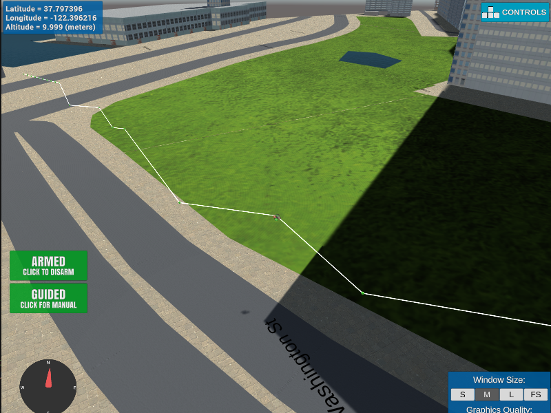

## Project: 3D Motion Planning


---


# Required Steps for a Passing Submission:
1. Load the 2.5D map in the colliders.csv file describing the environment.
2. Discretize the environment into a grid or graph representation.
3. Define the start and goal locations.
4. Perform a search using A* or other search algorithm.
5. Use a collinearity test or ray tracing method (like Bresenham) to remove unnecessary waypoints.
6. Return waypoints in local ECEF coordinates (format for `self.all_waypoints` is [N, E, altitude, heading], where the drone’s start location corresponds to [0, 0, 0, 0].
7. Write it up.
8. Congratulations!  Your Done!

## [Rubric](https://review.udacity.com/#!/rubrics/1534/view) Points
### Here I will consider the rubric points individually and describe how I addressed each point in my implementation.  

---
### Writeup / README

#### 1. Provide a Writeup / README that includes all the rubric points and how you addressed each one.  You can submit your writeup as markdown or pdf.  

You're reading it! Below I describe how I addressed each rubric point and where in my code each point is handled.

### Explain the Starter Code

#### 1. Explain the functionality of what's provided in `motion_planning.py` and `planning_utils.py`
In `planning_utils.py`, contains a basic planning implementation that includes A* algorithm, heuristic and generating grid map function using map data.

Compared with `backyard_flyer_solution.py`, `motion_planning.py` added new state which called **PLANNING**. And *path_plan* function which is activated in **PLANNING** state make waypoints for flying A(starting point) to B(destination).

Here's a generated waypoints image of starter code of `motion_planning.py`


### Implementing Your Path Planning Algorithm

#### 1. Set your global home position
I used np.loadtxt and got 2 splited string which are **lat0 37.792480**, **lon0 -122.397450**. And then splited these string using split function and got float numbers. But these were still string data, so I converted float64 data using *np.float64*. Finally, I set those lat0 and lon0 as my home position using *set_home_position* function.
```
data = np.loadtxt('colliders.csv', delimiter=',', dtype='U16', usecols = (0, 1))
lat0 = np.float64(data[0, 0].split(' ')[1])
lon0 = np.float64(data[0, 1].split(' ')[2])
self.set_home_position(lon0, lat0, 0)
```
Below map image(downtown San Fransisco) includes above latitude and longitude.


#### 2. Set your current local position
Before set my current local position, I have to my global position. So I used *global_position* function in `udacidrone/drone.py`. This function return my drone's logitude, latitude and altitude data in global coordinate.
 
```
    @property
    def global_position(self):
        return np.array([self._longitude, self._latitude, self._altitude])
```

After get global position, transform global coordinate to local coordinate.

```
global_pos = self.global_position
local_pos = global_to_local(global_pos, self.global_home)
```

#### 3. Set grid start position from local position
*create_grid* function return grid map and that map's offset. And using those offset so can set grid start position from local position.
```
data = np.loadtxt('colliders.csv', delimiter=',', dtype='Float64', skiprows = 2)
grid, north_offset, east_offset = create_grid(data, TARGET_ALTITUDE, SAFETY_DISTANCE)
grid_start = (int(-north_offset + local_pos[0]), int(-east_offset + local_pos[1]))
```
#### 4. Set grid goal position from geodetic coords
I set arbitrary point in the map.
```
GOAL_LAT = 37.797638
GOAL_LON = -122.394808
```
I transformed these to local coordinate. And set grid goal position from local position.
```
local_goal = global_to_local([GOAL_LON, GOAL_LAT, 0], self.global_home)
grid_goal = (int(-north_offset + local_goal[0]), int(-east_offset + local_goal[1]))
```

#### 5. Modify A* to include diagonal motion (or replace A* altogether)
I modified `planning_utils.py`. In *Action* class, I added 4 member tuples which are NE(North and East), NW(North and West), SE(South and East) and SW(South and West). These represent diagonal actions so their costs are square root of 2.
```
NE = (-1, 1, np.sqrt(2))
NW = (-1, -1, np.sqrt(2))
SE = (1, 1, np.sqrt(2))
SW = (1, -1, np.sqrt(2))
```
In *valid_actions* function, add some codes for checking if the node is off the grid or there is an obstacle.
```
if x - 1 < 0 or y + 1 > m or grid[x - 1, y + 1] == 1:
    valid_actions.remove(Action.NE)
if x - 1 < 0 or y - 1 < 0 or grid[x - 1, y - 1] == 1:
    valid_actions.remove(Action.NW)
if x + 1 > m or y + 1 > m or grid[x + 1, y + 1] == 1:
    valid_actions.remove(Action.SE)
if x + 1 > m or y - 1 < 0 or grid[x + 1, y - 1] == 1:
    valid_actions.remove(Action.SW)
```
Then, A* algorithm also consider diagonal actions.


#### 6. Cull waypoints 
I used collinearity test. Grid indexes are all int type. So, I used int type determinant calculation for collinearity check.
```
        pruned_path =  copy.deepcopy(path)
        for i in range(1, len(path) - 1):
            p1 = path[i-1]
            p2 = path[i]
            p3 = path[i+1]
            det = p1[0]*(p2[1] - p3[1]) + p2[0]*(p3[1] - p1[1]) + p3[0]*(p1[1] - p2[1])
            if det == 0:
                pruned_path.remove(p2)
        path = pruned_path
```
There are flight images below. You can see waypoints.





### Execute the flight
#### 1. Does it work?
It works!

### Double check that you've met specifications for each of the [rubric](https://review.udacity.com/#!/rubrics/1534/view) points.
  
# Extra Challenges: Real World Planning

For an extra challenge, consider implementing some of the techniques described in the "Real World Planning" lesson. You could try implementing a vehicle model to take dynamic constraints into account, or implement a replanning method to invoke if you get off course or encounter unexpected obstacles.

SOON!!


